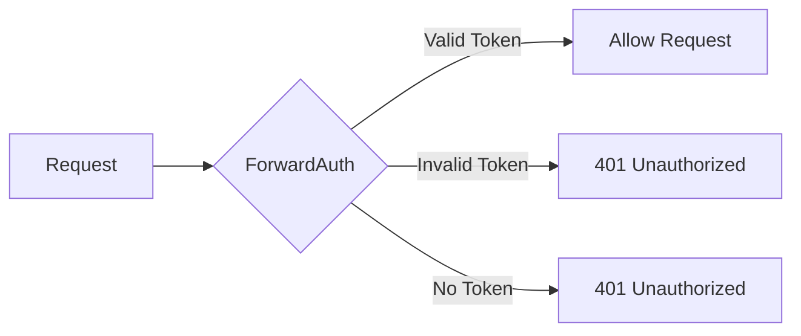
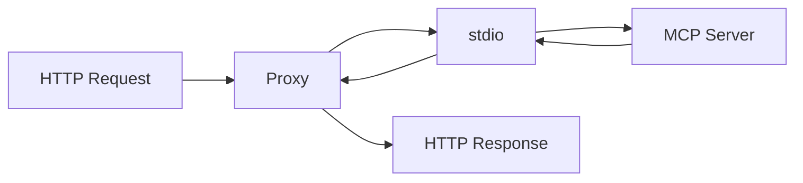
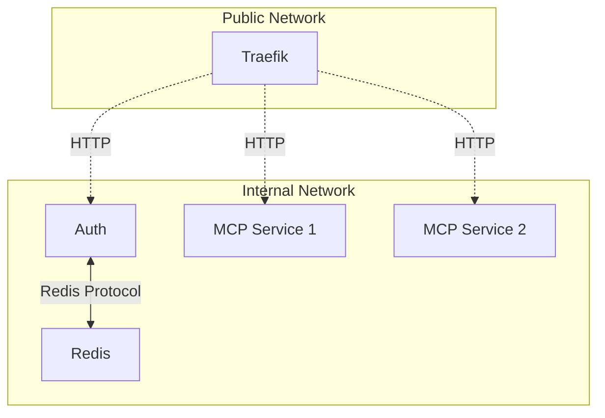

# Component Architecture

This document provides detailed information about each component in the MCP OAuth Gateway architecture.

## Traefik Reverse Proxy

### Overview

Traefik serves as the entry point for all requests, providing:
- Intelligent request routing
- SSL/TLS termination
- Authentication enforcement
- Load balancing

### Configuration

Traefik is configured through Docker labels on each service:

```yaml
labels:
  # Service routing
  - "traefik.enable=true"
  - "traefik.http.routers.service.rule=Host(`service.domain.com`)"
  - "traefik.http.routers.service.priority=2"
  
  # Authentication middleware
  - "traefik.http.middlewares.auth.forwardauth.address=http://auth:8000/verify"
  - "traefik.http.routers.service.middlewares=auth@docker"
  
  # SSL configuration
  - "traefik.http.routers.service.tls=true"
  - "traefik.http.routers.service.tls.certresolver=letsencrypt"
```

### Routing Priority System

Traefik uses a priority system to ensure correct request routing:

1. **Priority 10**: Discovery endpoints (`/.well-known/*`)
2. **Priority 4**: OAuth endpoints (`/register`, `/authorize`, `/token`)
3. **Priority 3**: Support endpoints (`/verify`)
4. **Priority 2**: MCP endpoints with authentication
5. **Priority 1**: Catch-all routes

### ForwardAuth Middleware

The ForwardAuth middleware validates every request to protected endpoints:



## Auth Service

### Architecture

The Auth Service is built with FastAPI and implements:
- OAuth 2.1 authorization server
- RFC 7591/7592 dynamic client registration
- GitHub OAuth integration
- JWT token management

### Key Components

#### OAuth Handler
```python
# Handles OAuth flows
- Authorization endpoint
- Token endpoint
- Callback processing
- PKCE validation
```

#### Client Registry
```python
# Manages OAuth clients
- Dynamic registration
- Client credentials
- Redirect URI validation
- Lifetime management
```

#### Token Manager
```python
# JWT token operations
- Token generation
- Signature verification
- Claims validation
- Revocation support
```

#### GitHub Integration
```python
# User authentication
- OAuth flow initiation
- Token exchange
- User info retrieval
- Access control
```

### Database Schema (Redis)

```
oauth:client:{client_id}       # Client registration data
oauth:state:{state}            # OAuth state (5min TTL)
oauth:code:{code}              # Authorization codes (1year TTL)
oauth:token:{jti}              # Token tracking (30day TTL)
oauth:refresh:{token}          # Refresh tokens (1year TTL)
oauth:user_tokens:{username}   # User token index
```

## MCP Services

### Service Types

#### 1. Wrapped Services (stdio-based)

These services use `mcp-streamablehttp-proxy` to wrap official MCP servers:



**Examples**: mcp-fetch, mcp-filesystem, mcp-time

#### 2. Native Services (HTTP-based)

These services implement the streamable HTTP protocol directly:


**Examples**: mcp-fetchs, mcp-everything

### MCP Streamable HTTP Proxy

The proxy provides critical functionality:

#### Session Management
- Creates subprocess per session
- Maintains session state
- Handles session cleanup
- Implements timeouts

#### Protocol Bridging
- HTTP to stdio conversion
- JSON-RPC message routing
- Error translation
- Response streaming

#### Health Monitoring
```python
# Health check implementation
- Process liveness check
- Protocol initialization test
- Timeout handling
- Error recovery
```

### Service Configuration

Each MCP service follows a standard configuration pattern:

```yaml
# docker-compose.yml
services:
  mcp-service:
    build: .
    environment:
      - MCP_PROTOCOL_VERSION=${MCP_PROTOCOL_VERSION}
      - SERVER_NAME=mcp-service
    labels:
      # Traefik routing
      - "traefik.http.routers.mcp-service.rule=..."
      - "traefik.http.routers.mcp-service.middlewares=auth"
    healthcheck:
      test: ["CMD", "curl", "-f", "-X", "POST", "http://localhost:3000/mcp", ...]
```

## Redis State Store

### Purpose

Redis provides persistent state storage for:
- OAuth flows
- Client registrations
- Token management
- Session state

### Key Patterns

```redis
# OAuth State Management
oauth:state:{state}           # Temporary OAuth state
oauth:code:{code}             # Authorization codes
oauth:pkce:{code_challenge}   # PKCE verifiers

# Client Management
oauth:client:{client_id}      # Client metadata
oauth:client_index            # Client ID index

# Token Management
oauth:token:{jti}             # Active tokens
oauth:refresh:{token}         # Refresh tokens
oauth:user_tokens:{username}  # User token index

# Session Management
session:{session_id}:state    # MCP session state
session:{session_id}:messages # Pending messages
```

### High Availability

Redis can be configured for HA using:
- Redis Sentinel for automatic failover
- Redis Cluster for sharding
- Persistence with AOF/RDB

## Inter-Component Communication

### Service Discovery

Services discover each other through:
- Docker DNS resolution
- Service names in compose
- Internal network routing

### Communication Patterns



### Security Boundaries

- **Public Network**: Internet-facing services
- **Internal Network**: Service-to-service only
- **No Direct Access**: MCP services isolated from internet

## Monitoring and Observability

### Health Checks

Each component implements health checks:

```bash
# Traefik
GET /ping

# Auth Service
Internal health via Docker healthcheck

# MCP Services
POST /mcp (initialization check)

# Redis
PING command
```

### Logging

Centralized logging architecture:
- All services log to stdout/stderr
- Docker captures and routes logs
- Logs stored in `./logs/` directory
- Structured JSON logging

### Monitoring

Key areas to monitor through logs and Docker stats:
- Service uptime
- Request patterns
- Error rates
- Resource usage

## Next Steps

- [OAuth Flow Details](oauth-flow.md) - Complete OAuth implementation
- [MCP Integration](mcp-integration.md) - Protocol bridging details
- [Security Architecture](security.md) - Security deep dive