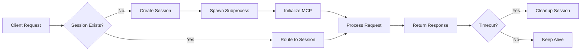

# mcp-streamablehttp-proxy

The divine bridge that wraps stdio-based MCP servers with StreamableHTTP endpoints, enabling web-based access to official MCP servers.

## Quick Start

**Key Features:**
- Universal support for any stdio-based MCP server
- No server modifications required
- Session management with isolated subprocesses
- Full MCP protocol support with JSON-RPC 2.0
- Production-ready with health monitoring

**Installation:**
```bash
# Via pip
pip install mcp-streamablehttp-proxy

# Via pixi
pixi add --pypi mcp-streamablehttp-proxy
```

**Basic Usage:**
```bash
# Wrap a Python MCP server module
mcp-streamablehttp-proxy python -m mcp_server_fetch

# Wrap an executable MCP server
mcp-streamablehttp-proxy /usr/local/bin/mcp-server-filesystem --root /data

# Wrap an NPM-based MCP server
mcp-streamablehttp-proxy npx @modelcontextprotocol/server-memory
```

## Table of Contents

1. [Overview](#overview)
2. [Architecture](#architecture)
3. [Installation](#installation)
4. [Usage](#usage)
5. [Command Line Options](#command-line-options)
6. [How It Works](#how-it-works)
7. [API Reference](#api-reference)
8. [Session Management](#session-management)
9. [Subprocess Management](#subprocess-management)
10. [Error Handling](#error-handling)
11. [Docker Deployment](#docker-deployment)
12. [Performance Tuning](#performance-tuning)
13. [Security Considerations](#security-considerations)
14. [Monitoring and Health Checks](#monitoring-and-health-checks)
15. [Troubleshooting](#troubleshooting)
16. [Integration Patterns](#integration-patterns)
17. [Best Practices](#best-practices)
18. [Advanced Configuration](#advanced-configuration)
19. [Limitations](#limitations)

## Overview

`mcp-streamablehttp-proxy` is a universal bridge that enables any stdio-based MCP (Model Context Protocol) server to be accessed via HTTP endpoints. This proxy is essential for integrating traditional MCP servers with web infrastructure, API gateways, and OAuth authentication systems. It manages sessions, spawns server subprocesses, and handles protocol translation transparently.

The proxy acts as a protocol translator, wrapping existing stdio MCP servers (like the official ones from modelcontextprotocol/servers) and exposing them via HTTP endpoints. This enables:

- Web access to stdio-only MCP servers
- OAuth authentication integration via gateway
- Session management for stateful servers
- Health monitoring for container orchestration
- No modifications to existing MCP servers

## Architecture

### Core Purpose

```
┌──────────────┐    stdio    ┌─────────────────────┐    HTTP    ┌──────────────┐
│  MCP Server  │ ←--------→ │  StreamableHTTP     │ ←--------→ │  MCP Client  │
│  (stdio)     │  JSON-RPC  │      Proxy          │   /mcp     │  (HTTP)      │
└──────────────┘            └─────────────────────┘            └──────────────┘
```

### Key Components

```
mcp_streamablehttp_proxy/
├── __init__.py          # Package initialization
├── __main__.py          # Module entry point
├── cli.py               # Command-line interface
├── server.py            # Server runner
├── proxy.py             # Main proxy implementation
├── session.py           # Session management
└── models.py            # Data models
```

### Core Classes

```python
# Core components
StreamableHTTPProxy      # Main FastAPI application
SessionManager          # Client session tracking
ProcessManager          # Subprocess lifecycle
StdioTransport         # stdio communication
MessageRouter          # Request/response routing
```

## Installation

### Via pip
```bash
pip install mcp-streamablehttp-proxy
```

### Via pixi
```bash
pixi add --pypi mcp-streamablehttp-proxy
```

### Docker
```dockerfile
FROM python:3.11-slim

# Install proxy and desired MCP server
RUN pip install mcp-streamablehttp-proxy mcp-server-fetch

# Create non-root user
RUN useradd -m -s /bin/bash mcp
USER mcp

# Expose port
EXPOSE 3000

# Bind to 0.0.0.0 for container networking
CMD ["mcp-streamablehttp-proxy", "--host", "0.0.0.0", "python", "-m", "mcp_server_fetch"]
```

## Usage

### Basic Usage

**Python MCP Server Module**:
```bash
mcp-streamablehttp-proxy python -m mcp_server_fetch
```

**Executable MCP Server**:
```bash
mcp-streamablehttp-proxy /usr/local/bin/mcp-server-filesystem --root /data
```

**NPM-based MCP Server**:
```bash
mcp-streamablehttp-proxy npx @modelcontextprotocol/server-memory
```

### Wrapping Official MCP Servers

#### Fetch Server
```dockerfile
FROM python:3.12-slim
RUN pip install mcp-streamablehttp-proxy mcp-server-fetch
CMD ["mcp-streamablehttp-proxy", "--host", "0.0.0.0", "python", "-m", "mcp_server_fetch"]
```

#### Filesystem Server
```dockerfile
FROM python:3.12-slim
RUN pip install mcp-streamablehttp-proxy mcp-server-filesystem
CMD ["mcp-streamablehttp-proxy", "--host", "0.0.0.0", "mcp-server-filesystem", "--root", "/data", "--read-only"]
```

#### Time Server
```dockerfile
FROM python:3.12-slim
RUN pip install mcp-streamablehttp-proxy mcp-server-time
CMD ["mcp-streamablehttp-proxy", "--host", "0.0.0.0", "python", "-m", "mcp_server_time"]
```

## Command Line Options

```
mcp-streamablehttp-proxy [OPTIONS] <server_command> [server_args...]

Options:
  --host TEXT         Host to bind to (default: 127.0.0.1)
  --port INTEGER      Port to bind to (default: 3000)
  --timeout INTEGER   Session timeout in seconds (default: 300)
  --log-level TEXT    Log level: debug/info/warning/error (default: info)
  --help             Show this message and exit
```

### Environment Variables

| Variable | Description | Default |
|----------|-------------|---------||
| `MCP_BIND_HOST` | Override bind host | 127.0.0.1 |
| `MCP_PORT` | Override port | 3000 |
| `MCP_SESSION_TIMEOUT` | Session timeout in seconds | 300 |
| `MCP_LOG_LEVEL` | Logging level | INFO |
| `LOG_FILE` | Enable file logging | None |
| `MCP_SUBPROCESS_TIMEOUT` | Subprocess request timeout | 30 |
| `MCP_STARTUP_TIMEOUT` | Startup timeout | 10 |
| `MCP_MAX_SESSIONS` | Maximum concurrent sessions | 100 |
| `MCP_READ_BUFFER_SIZE` | Read buffer size | 65536 |
| `MCP_WRITE_BUFFER_SIZE` | Write buffer size | 65536 |

## How It Works

### Request Flow

1. **HTTP Request**: Client sends POST to `/mcp`
2. **Session Check**:
   - First request: Create session, spawn subprocess
   - Subsequent: Route to existing session
3. **Protocol Translation**: HTTP JSON → stdio JSON-RPC
4. **Server Processing**: MCP server processes request
5. **Response Translation**: stdio JSON-RPC → HTTP JSON
6. **Session Header**: Response includes `Mcp-Session-Id`

### Session Lifecycle



## API Reference

### HTTP Endpoints

#### POST /mcp
Single endpoint for all MCP protocol messages.

**Headers**:
- `Content-Type: application/json` (required)
- `Mcp-Session-Id: <uuid>` (required after initialization)

**Request Body**:
Standard JSON-RPC 2.0 message:
```json
{
  "jsonrpc": "2.0",
  "method": "initialize",
  "params": {
    "protocolVersion": "2024-11-05",
    "capabilities": {},
    "clientInfo": {
      "name": "example-client",
      "version": "1.0.0"
    }
  },
  "id": 1
}
```

**Response**:
```json
{
  "jsonrpc": "2.0",
  "result": {
    "protocolVersion": "2024-11-05",
    "capabilities": {
      "tools": {},
      "resources": {}
    },
    "serverInfo": {
      "name": "example-server",
      "version": "1.0.0"
    }
  },
  "id": 1
}
```

**Response Headers**:
- `Mcp-Session-Id: <uuid>` (on initialization)

**Response (SSE stream alternative):**
```
event: message
data: {"jsonrpc": "2.0", "result": {"protocolVersion": "2025-06-18", ...}, "id": 1}

event: done
data: {"status": "complete"}
```

#### GET /health
Health check endpoint.

```http
GET /health HTTP/1.1

Response:
{
  "status": "healthy",
  "subprocess": "running",
  "sessions": 5,
  "uptime": 3600
}
```

### Error Responses

**Session Not Found**:
```json
{
  "jsonrpc": "2.0",
  "error": {
    "code": -32603,
    "message": "Session not found"
  },
  "id": 1
}
```

**Request Timeout**:
```json
{
  "jsonrpc": "2.0",
  "error": {
    "code": -32603,
    "message": "Request timeout"
  },
  "id": 1
}
```

## Session Management

### Session Data Structure

```python
{
    "session_id": "uuid-v4",
    "created_at": "2024-01-01T00:00:00Z",
    "last_activity": "2024-01-01T00:01:00Z",
    "process": subprocess.Popen,
    "stdin": StreamWriter,
    "stdout": StreamReader,
    "stderr": StreamReader,
    "pending_requests": {},
    "initialized": False
}
```

### Session Creation

When a client first connects without a session ID:

```python
# Proxy creates new session
session_id = generate_session_id()
subprocess = spawn_mcp_server()
sessions[session_id] = {
    "process": subprocess,
    "created": time.time(),
    "last_activity": time.time()
}
```

### Session Usage

Subsequent requests include session ID:

```http
POST /mcp
Mcp-Session-Id: session-123
```

### Session Cleanup

Sessions are cleaned up when:
1. **Timeout**: No activity for session_timeout seconds
2. **Process Exit**: MCP server terminates
3. **Explicit Close**: Client sends close notification
4. **Error**: Unrecoverable error occurs
5. **Proxy Shutdown**: Graceful termination

### Resource Management

- One subprocess per session
- Automatic process termination on cleanup
- Bounded request queue per session
- Memory-efficient streaming I/O

## Subprocess Management

### Starting Subprocesses

```python
# Proxy spawns MCP server
process = subprocess.Popen(
    [mcp_command] + mcp_args,
    stdin=subprocess.PIPE,
    stdout=subprocess.PIPE,
    stderr=subprocess.PIPE,
    text=False  # Binary mode for proper encoding
)
```

### Health Monitoring

The proxy monitors subprocess health:
- Checks process is alive
- Monitors stdio responsiveness
- Restarts on crash (configurable)
- Reports health via `/health`

### Graceful Shutdown

On proxy shutdown:
1. Send shutdown to all subprocesses
2. Wait for graceful termination
3. Force kill if timeout exceeded
4. Clean up resources

## Error Handling

### Common Errors and Solutions

| Error | Cause | Solution |
|-------|-------|----------|
| Session not found | Invalid/expired session | Initialize new session |
| Request timeout | Server took >30s | Check server health |
| Subprocess died | Server crashed | Check server logs |
| Invalid request | Malformed JSON-RPC | Verify request format |
| Port already in use | Another process on port | Change port with --port |
| Process crash | Server died | Restart or fail session |
| Startup timeout | Server slow/hung | Kill and retry |
| Communication error | Broken pipe | Terminate session |

### Protocol Errors

| Error | Response |
|-------|----------|
| Invalid JSON-RPC | 400 Bad Request |
| Unknown session | 404 Not Found |
| Server error | 500 with error details |

## Docker Deployment

### Basic Dockerfile

```dockerfile
FROM python:3.11-slim

# Install proxy and MCP server
RUN pip install mcp-streamablehttp-proxy mcp-server-fetch

# Create non-root user
RUN useradd -m -s /bin/bash mcp
USER mcp

# Expose port
EXPOSE 3000

# Run proxy
CMD ["mcp-streamablehttp-proxy", "--host", "0.0.0.0", "--port", "3000", "python", "-m", "mcp_server_fetch"]
```

### Docker Compose with Traefik

```yaml
services:
  mcp-fetch:
    build: ./mcp-streamablehttp-proxy
    environment:
      - MCP_BIND_HOST=0.0.0.0
      - MCP_PORT=3000
      - MCP_LOG_LEVEL=INFO
    networks:
      - internal
    labels:
      - "traefik.enable=true"
      - "traefik.http.routers.mcp-fetch.rule=Host(`mcp-fetch.example.com`)"
      - "traefik.http.services.mcp-fetch.loadbalancer.server.port=3000"
      - "traefik.http.routers.mcp-fetch.middlewares=mcp-auth"
      - "traefik.http.middlewares.mcp-auth.forwardauth.address=http://auth:8000/verify"
    healthcheck:
      test: ["CMD", "curl", "-f", "http://localhost:3000/mcp", "-X", "POST",
             "-H", "Content-Type: application/json",
             "-d", '{"jsonrpc":"2.0","method":"initialize","params":{"protocolVersion":"2024-11-05","capabilities":{},"clientInfo":{"name":"healthcheck","version":"1.0"}},"id":1}']
      interval: 30s
      timeout: 5s
      retries: 3
```

### Multiple MCP Services

```yaml
services:
  mcp-fetch:
    build: .
    command: ["mcp-streamablehttp-proxy", "python", "-m", "mcp_server_fetch"]

  mcp-filesystem:
    build: .
    command: ["mcp-streamablehttp-proxy", "mcp-server-filesystem", "--root", "/data"]

  mcp-memory:
    build: .
    command: ["mcp-streamablehttp-proxy", "npx", "@modelcontextprotocol/server-memory"]
```

## Performance Tuning

### Connection Pooling

```python
# Reuse sessions where possible
connection_pool = {
    "max_idle": 10,
    "idle_timeout": 300
}
```

### Buffer Sizes

```bash
# Tune for large responses
MCP_READ_BUFFER_SIZE=65536
MCP_WRITE_BUFFER_SIZE=65536
```

### Concurrent Sessions

```bash
# Limit concurrent sessions
MCP_MAX_SESSIONS=100
MCP_SESSION_TIMEOUT=3600
```

### Resource Usage

- **Memory**: ~10MB base + subprocess memory
- **CPU**: Minimal overhead (I/O bound)
- **Connections**: One subprocess per active session
- **File Descriptors**: 3 per session (stdin/stdout/stderr)

### Scaling Recommendations

1. **Horizontal Scaling**: Run multiple proxy instances
2. **Load Balancing**: Use sticky sessions (session affinity)
3. **Resource Limits**: Set container memory/CPU limits
4. **Session Timeout**: Adjust based on usage patterns
5. **Connection Pooling**: Not applicable (one process per session)

### Optimization Tips

- Use shorter session timeouts for high-traffic scenarios
- Monitor subprocess resource usage
- Implement health checks to detect unhealthy instances
- Use process managers for automatic restart

## Security Considerations

### Important Notes

⚠️ **This proxy provides NO authentication or authorization!**

Always deploy behind an authenticating reverse proxy with:
- OAuth2/JWT authentication
- Rate limiting
- Access control lists
- HTTPS termination
- Request validation

### Security Best Practices

1. **Process Isolation**: Each session gets its own subprocess
2. **Resource Limits**: Configure max sessions and timeouts
3. **Input Validation**: Validate all JSON-RPC messages
4. **Subprocess Sandboxing**: Use containers for isolation
5. **Authentication**: Handled by gateway layer (not proxy)
6. **Network Isolation**: Don't expose directly to internet
7. **Minimal Privileges**: Run with minimal user permissions
8. **Audit Logging**: Log all session creation

### Example Secure Deployment

```yaml
services:
  traefik:
    image: traefik:v3.0
    command:
      - "--providers.docker=true"
      - "--entrypoints.websecure.address=:443"
    ports:
      - "443:443"

  auth:
    image: mcp-oauth-dynamicclient
    environment:
      - JWT_SECRET=${JWT_SECRET}

  mcp-proxy:
    image: mcp-streamablehttp-proxy
    labels:
      - "traefik.http.routers.mcp.middlewares=auth-forward"
      - "traefik.http.middlewares.auth-forward.forwardauth.address=http://auth:8000/verify"
```

## Monitoring and Health Checks

### Health Check Implementation

```python
async def health_check():
    """Check if proxy can spawn and communicate with MCP server."""
    try:
        # Create test session
        session_id = await create_session()

        # Send initialize request
        response = await send_request(session_id, {
            "jsonrpc": "2.0",
            "method": "initialize",
            "params": {
                "protocolVersion": "2024-11-05",
                "capabilities": {},
                "clientInfo": {"name": "health", "version": "1.0"}
            },
            "id": 1
        })

        # Cleanup
        await cleanup_session(session_id)

        return response.get("result") is not None
    except Exception:
        return False
```

### Metrics to Monitor

- Active session count
- Session creation rate
- Request latency
- Error rate
- Subprocess resource usage
- Session duration
- Subprocess CPU/memory usage

### Logging

```python
# Structured logging
logger.info("session_created", extra={
    "session_id": session_id,
    "client_ip": client_ip,
    "mcp_server": mcp_command
})
```

## Troubleshooting

### Proxy Won't Start

1. **Check Port Availability**:
```bash
lsof -i :3000
```

2. **Verify MCP Server**:
```bash
# Test server directly
echo '{"jsonrpc":"2.0","method":"initialize","params":{},"id":1}' | python -m mcp_server_fetch
```

3. **Check Permissions**:
```bash
# Ensure executable permissions
which mcp-streamablehttp-proxy
ls -la $(which mcp-streamablehttp-proxy)
```

### Sessions Immediately Timeout

1. **Increase Timeout**:
```bash
mcp-streamablehttp-proxy --timeout 600 <server_command>
```

2. **Check Server Startup Time**:
- Some servers take time to initialize
- Monitor logs for startup messages

3. **Verify JSON Output**:
- Server must output line-delimited JSON
- No extra output to stdout

### Requests Hang

1. **Enable Debug Logging**:
```bash
mcp-streamablehttp-proxy --log-level debug <server_command>
```

2. **Check Process State**:
```bash
ps aux | grep mcp
```

3. **Monitor Network**:
```bash
netstat -an | grep 3000
```

### Common Debug Checks

1. Verify MCP server works standalone
2. Check subprocess output in logs
3. Monitor session creation/cleanup
4. Validate JSON-RPC format

## Integration Patterns

### With MCP OAuth Gateway

The proxy is designed for seamless integration:

1. **Proxy** exposes MCP servers as HTTP
2. **Traefik** provides routing and auth middleware
3. **OAuth Gateway** handles authentication
4. **Clients** access with Bearer tokens

### With Traefik
```yaml
labels:
  - "traefik.enable=true"
  - "traefik.http.routers.service.rule=Host(`service.domain`)"
  - "traefik.http.services.service.loadbalancer.server.port=3000"
```

### With Logging
```yaml
logging:
  driver: "json-file"
  options:
    max-size: "10m"
    max-file: "3"
```

## Best Practices

1. **One Proxy per Server Type**: Don't mix different MCP servers
2. **Resource Limits**: Set memory/CPU limits in production
3. **Health Checks**: Implement health endpoints
4. **Logging**: Centralize logs for debugging
5. **Security**: Always use authentication middleware
6. **Updates**: Keep both proxy and MCP servers updated
7. **Session Management**: Configure appropriate timeouts
8. **Error Handling**: Monitor and alert on errors

## Advanced Configuration

### Custom Session Manager

```python
from mcp_streamablehttp_proxy import SessionManager

class CustomSessionManager(SessionManager):
    def __init__(self, *args, **kwargs):
        super().__init__(*args, **kwargs)
        self.max_sessions = 100

    async def create_session(self):
        if len(self.sessions) >= self.max_sessions:
            raise Exception("Max sessions reached")
        return await super().create_session()
```

### Request Interceptor

```python
async def request_interceptor(session_id: str, request: dict):
    """Modify requests before sending to MCP server."""
    # Add custom headers
    if request.get("method") == "tools/call":
        request["params"]["custom"] = "value"
    return request
```

### Testing with curl

**Initialize Session**:
```bash
# Start the proxy
mcp-streamablehttp-proxy python -m mcp_server_fetch

# Initialize and capture session ID
SESSION_ID=$(curl -s -X POST http://localhost:3000/mcp \
  -H "Content-Type: application/json" \
  -d '{"jsonrpc":"2.0","method":"initialize","params":{"protocolVersion":"2024-11-05","capabilities":{},"clientInfo":{"name":"test","version":"1.0"}},"id":1}' \
  -i | grep -i mcp-session-id | cut -d' ' -f2 | tr -d '\r')

echo "Session ID: $SESSION_ID"
```

**List Tools**:
```bash
curl -X POST http://localhost:3000/mcp \
  -H "Content-Type: application/json" \
  -H "Mcp-Session-Id: $SESSION_ID" \
  -d '{"jsonrpc":"2.0","method":"tools/list","id":2}'
```

**Call Tool**:
```bash
curl -X POST http://localhost:3000/mcp \
  -H "Content-Type: application/json" \
  -H "Mcp-Session-Id: $SESSION_ID" \
  -d '{
    "jsonrpc":"2.0",
    "method":"tools/call",
    "params":{
      "name":"fetch",
      "arguments":{"url":"https://example.com"}
    },
    "id":3
  }'
```

## Limitations

1. **One Process per Session**: Resource intensive for many sessions
2. **No Request Queuing**: Parallel requests within session not queued
3. **30s Request Timeout**: Not configurable per-request
4. **stdio Only**: Doesn't support other MCP transports
5. **No Built-in Auth**: Requires external authentication
6. **Session Affinity Required**: Load balancers must use sticky sessions
7. **No Session Persistence**: Sessions lost on restart
