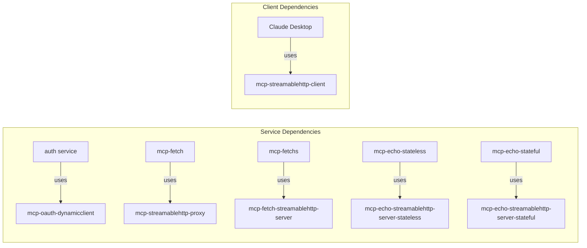

# Python Packages

The MCP OAuth Gateway consists of several Python packages that work together to provide a complete OAuth-protected MCP infrastructure. Each package has a specific role and can be used independently or as part of the complete system.

## Package Architecture

```{mermaid}
graph TB
    subgraph "Client Side"
        C[mcp-streamablehttp-client]
    end

    subgraph "Gateway Infrastructure"
        O[mcp-oauth-dynamicclient]
        P[mcp-streamablehttp-proxy]
        F[mcp-fetch-streamablehttp-server]
        ES[mcp-echo-streamablehttp-server-stateless]
        EST[mcp-echo-streamablehttp-server-stateful]
    end

    subgraph "External Dependencies"
        MC[MCP Clients<br/>Claude Desktop, IDEs]
        MS[MCP Servers<br/>Official stdio servers]
    end

    MC -->|stdio| C
    C -->|HTTP + OAuth| O
    O -->|Authentication| P
    O -->|Authentication| F
    O -->|Authentication| ES
    O -->|Authentication| EST
    P -->|stdio| MS

    classDef client fill:#9cf,stroke:#333,stroke-width:2px
    classDef infra fill:#fc9,stroke:#333,stroke-width:2px
    classDef external fill:#ccc,stroke:#333,stroke-width:2px
    classDef diagnostic fill:#f9f,stroke:#333,stroke-width:2px

    class C client
    class O,P,F infra
    class ES,EST diagnostic
    class MC,MS external
```

## Core Packages

### [mcp-oauth-dynamicclient](./mcp-oauth-dynamicclient.md)
**OAuth 2.1 Authorization Server Library**

The foundational OAuth implementation that powers authentication across the gateway:
- RFC 7591/7592 compliant dynamic client registration
- GitHub OAuth integration for user authentication
- JWT token generation and validation
- Redis-backed storage for persistence
- FastAPI-based with async support

### [mcp-streamablehttp-proxy](./mcp-streamablehttp-proxy.md)
**Universal stdio-to-HTTP Bridge**

Enables any stdio-based MCP server to be exposed via HTTP:
- Wraps official MCP servers without modification
- Session management across HTTP requests
- Health monitoring via MCP protocol
- Process isolation for security
- Zero-configuration deployment

### [mcp-streamablehttp-client](./mcp-streamablehttp-client.md)
**Client Bridge with OAuth Support**

Connects stdio MCP clients to HTTP MCP servers:
- Automatic OAuth device flow authentication
- Token refresh and credential management
- Raw protocol mode for testing
- Discovery commands for server capabilities
- RFC 7592 client management support

### [mcp-fetch-streamablehttp-server](./mcp-fetch-streamablehttp-server.md)
**Native MCP Server Implementation**

Demonstrates native streamable HTTP implementation:
- Direct FastAPI implementation without proxy
- No subprocess overhead
- Built-in fetch tool with robots.txt compliance
- Native async/await throughout
- Reference implementation for new servers

### [mcp-echo-streamablehttp-server-stateless](./mcp-echo-streamablehttp-server-stateless.md)
**Advanced Diagnostic MCP Server (Stateless)**

Comprehensive diagnostic toolkit with AI analysis:
- 10 powerful diagnostic tools for debugging
- Integrated G.O.A.T. Recognition AI v3.14159
- Stateless operation for scalability
- OAuth flow analysis and JWT decoding
- System health and performance monitoring

### mcp-echo-streamablehttp-server-stateful
**Advanced Diagnostic MCP Server (Stateful)**

Enhanced diagnostic toolkit with session management:
- All tools from stateless variant
- Session-based message history
- `replayLastEcho` tool for session continuity
- 1-hour session timeout
- Perfect for interactive debugging sessions

## Package Relationships

### Installation Dependencies



### Communication Flow

1. **Client Authentication**: mcp-streamablehttp-client handles OAuth flow with mcp-oauth-dynamicclient
2. **Request Routing**: Authenticated requests flow through the gateway to appropriate services
3. **Service Types**:
   - Proxy-based: mcp-streamablehttp-proxy wraps stdio servers
   - Native: mcp-fetch-streamablehttp-server implements protocol directly

## Development Considerations

### Package Development

All packages follow consistent patterns:
- Built with `pixi` for dependency management
- Comprehensive test suites with `pytest`
- Type hints throughout for better IDE support
- Async support where applicable
- Minimal external dependencies

### Integration Testing

The packages are designed to work together but tested independently:
- Unit tests for individual components
- Integration tests for package interactions
- End-to-end tests for complete flows
- No mocking - all tests use real services

### Versioning Strategy

Packages use semantic versioning:
- Major: Breaking API changes
- Minor: New features, backward compatible
- Patch: Bug fixes and minor improvements

## Package Publishing

All packages in the MCP OAuth Gateway are designed for publication to PyPI. The repository includes comprehensive tooling and documentation for building, testing, and publishing packages.

### Quick Publishing Commands

```bash
# Test workflow (recommended first)
just pypi-publish-test [package]

# Production publishing
just pypi-publish [package]

# Individual operations
just pypi-build [package]      # Build distributions
just pypi-test [package]       # Run tests
just pypi-check [package]      # Validate with twine
```

For complete publishing documentation, see the [PyPI Publishing Guide](./pypi-publishing.md).

## Next Steps

- Explore individual package documentation for detailed API references
- Review the [PyPI Publishing Guide](./pypi-publishing.md) for package distribution
- Check [Architecture](../architecture.md) guide for system design
- See [Development Guidelines](../development/guidelines.md) for contribution standards
- Review [Installation Guide](../installation.md) for deployment instructions
