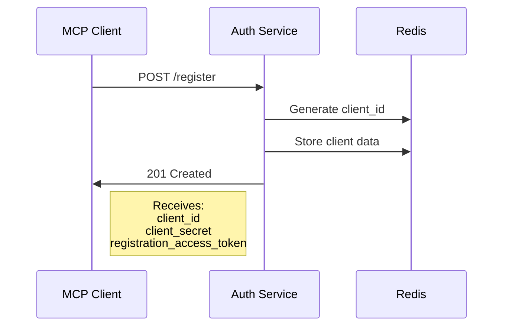
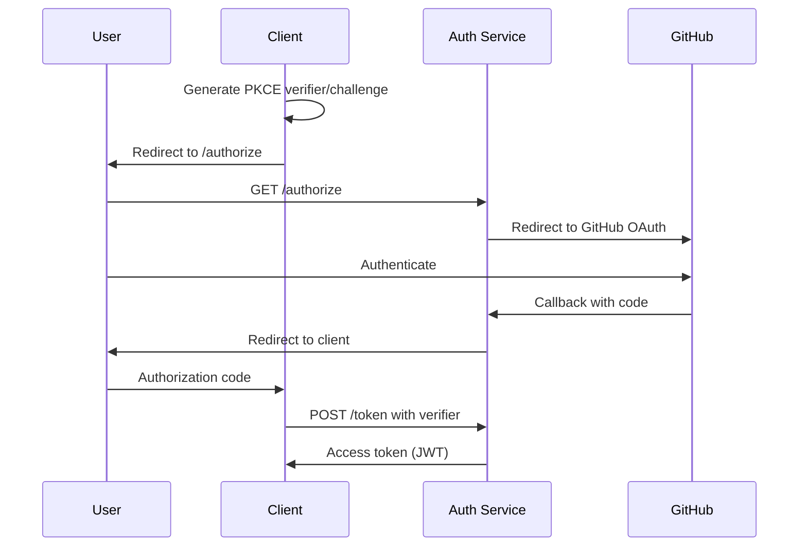
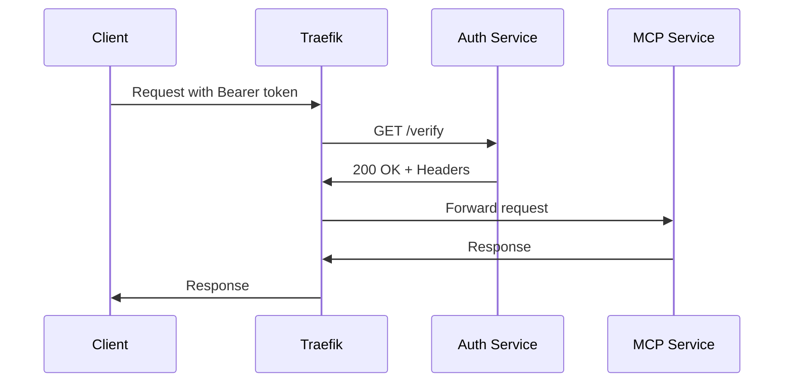

# Auth Service

The divine OAuth 2.1 authentication service that guards the gateway, implementing RFC 7591/7592 compliant dynamic client registration and user authentication.

## Overview

The Auth service is the authentication oracle of the gateway, built on `mcp-oauth-dynamicclient`. It provides:

- OAuth 2.1 authorization server
- Dynamic client registration (RFC 7591)
- Client management (RFC 7592)
- GitHub OAuth integration
- JWT token generation and validation
- ForwardAuth endpoint for Traefik

## Architecture

```
┌─────────────────────────────────────────┐
│            Auth Service                  │
├─────────────────────────────────────────┤
│  OAuth Endpoints  │  ForwardAuth        │
│  /authorize       │  /verify            │
│  /token           │                     │
│  /register        │  Management         │
│  /callback        │  /introspect        │
│  /.well-known/*   │  /revoke            │
├─────────────────────────────────────────┤
│         Redis Storage Backend            │
│  • Tokens  • Clients  • Sessions        │
└─────────────────────────────────────────┘
```

## Configuration

### Docker Compose

```yaml
services:
  auth:
    build:
      context: ./auth
      dockerfile: Dockerfile
    restart: unless-stopped
    environment:
      # GitHub OAuth
      - GITHUB_CLIENT_ID=${GITHUB_CLIENT_ID}
      - GITHUB_CLIENT_SECRET=${GITHUB_CLIENT_SECRET}

      # JWT Configuration
      - GATEWAY_JWT_SECRET=${GATEWAY_JWT_SECRET}
      - GATEWAY_RSA_PRIVATE_KEY=${GATEWAY_RSA_PRIVATE_KEY}
      - GATEWAY_RSA_PUBLIC_KEY=${GATEWAY_RSA_PUBLIC_KEY}

      # Token Lifetimes
      - ACCESS_TOKEN_LIFETIME=${ACCESS_TOKEN_LIFETIME:-2592000}
      - REFRESH_TOKEN_LIFETIME=${REFRESH_TOKEN_LIFETIME:-31536000}
      - CLIENT_LIFETIME=${CLIENT_LIFETIME:-7776000}

      # Access Control
      - ALLOWED_GITHUB_USERS=${ALLOWED_GITHUB_USERS}

      # Redis
      - REDIS_HOST=redis
      - REDIS_PORT=6379
      - REDIS_PASSWORD=${REDIS_PASSWORD}
    depends_on:
      redis:
        condition: service_healthy
    healthcheck:
      test: ["CMD", "curl", "-f", "http://localhost:8000/health"]
      interval: 30s
      timeout: 10s
      retries: 3
    networks:
      - public
    volumes:
      - ./logs/auth:/logs
      - auth-keys:/keys
    labels:
      # Traefik routing
      - "traefik.enable=true"
      - "traefik.http.routers.auth.rule=Host(`auth.${BASE_DOMAIN}`)"
      - "traefik.http.routers.auth.priority=4"
      - "traefik.http.routers.auth.tls=true"
      - "traefik.http.routers.auth.tls.certresolver=letsencrypt"
```

### Environment Variables

| Variable | Description | Default |
|----------|-------------|---------|
| `GITHUB_CLIENT_ID` | GitHub OAuth App ID | Required |
| `GITHUB_CLIENT_SECRET` | GitHub OAuth App Secret | Required |
| `GATEWAY_JWT_SECRET` | JWT signing secret | Required |
| `GATEWAY_RSA_PRIVATE_KEY` | RSA private key for RS256 | Optional |
| `GATEWAY_RSA_PUBLIC_KEY` | RSA public key for RS256 | Optional |
| `ACCESS_TOKEN_LIFETIME` | Access token TTL (seconds) | 2592000 (30 days) |
| `REFRESH_TOKEN_LIFETIME` | Refresh token TTL (seconds) | 31536000 (1 year) |
| `CLIENT_LIFETIME` | Client registration TTL | 7776000 (90 days) |
| `ALLOWED_GITHUB_USERS` | Comma-separated allowlist | Required |
| `REDIS_HOST` | Redis hostname | redis |
| `REDIS_PORT` | Redis port | 6379 |
| `REDIS_PASSWORD` | Redis password | Required |

## API Endpoints

### OAuth 2.0 Core

| Endpoint | Method | Purpose |
|----------|--------|---------|
| `/authorize` | GET | Start authorization flow |
| `/token` | POST | Exchange code for token |
| `/callback` | GET | GitHub OAuth callback |
| `/revoke` | POST | Revoke token |
| `/introspect` | POST | Token introspection |

### Dynamic Client Registration

| Endpoint | Method | Purpose |
|----------|--------|---------|
| `/register` | POST | Register new client (public) |
| `/register/{id}` | GET | Read client config |
| `/register/{id}` | PUT | Update client config |
| `/register/{id}` | DELETE | Delete client |

### Discovery & Metadata

| Endpoint | Method | Purpose |
|----------|--------|---------|
| `/.well-known/oauth-authorization-server` | GET | Server metadata |
| `/.well-known/openid-configuration` | GET | OpenID config |

### ForwardAuth Integration

| Endpoint | Method | Purpose |
|----------|--------|---------|
| `/verify` | GET | Verify token for Traefik |
| `/health` | GET | Service health check |

## Authentication Flows

### Client Registration Flow



### Authorization Code Flow with PKCE



### Token Verification (ForwardAuth)



## JWT Token Structure

```json
{
  "header": {
    "alg": "RS256",
    "typ": "JWT"
  },
  "payload": {
    "iss": "https://auth.example.com",
    "sub": "github|username",
    "aud": "client_abc123",
    "exp": 1234567890,
    "iat": 1234567890,
    "jti": "unique-token-id",
    "scope": "mcp:*",
    "github_username": "username",
    "github_id": "12345"
  }
}
```

## Redis Storage Schema

```
# Client registrations
oauth:client:{client_id} = {
  "client_id": "...",
  "client_secret": "...",
  "client_name": "...",
  "redirect_uris": [...],
  "registration_access_token": "reg-xxx",
  "created_at": "...",
  "expires_at": "..."
}

# OAuth states (CSRF protection)
oauth:state:{state} = {
  "client_id": "...",
  "redirect_uri": "...",
  "code_challenge": "...",
  "created_at": "..."
} # TTL: 5 minutes

# Authorization codes
oauth:code:{code} = {
  "client_id": "...",
  "user_id": "...",
  "scope": "...",
  "code_challenge": "...",
  "created_at": "..."
} # TTL: 1 year (for long-lived tokens)

# Access tokens
oauth:token:{jti} = {
  "client_id": "...",
  "user_id": "...",
  "scope": "...",
  "created_at": "...",
  "expires_at": "..."
} # TTL: 30 days

# User token index
oauth:user_tokens:{username} = ["jti1", "jti2", ...]
```

## Health Monitoring

### Health Endpoint

```http
GET /health

{
  "status": "healthy",
  "redis": "connected",
  "version": "0.2.0",
  "uptime": 3600
}
```

### Monitoring Metrics

- Active client registrations
- Token generation rate
- Authentication success/failure rate
- GitHub API rate limit status
- Redis connection status

## Security Features

### Token Security
- JWT signed with RS256 (or HS256)
- Short-lived access tokens
- Secure token storage in Redis
- Token revocation support

### Client Security
- Dynamic client registration
- Client secret rotation
- Registration access tokens
- Client expiration

### User Security
- GitHub OAuth for user auth
- User allowlist enforcement
- Session management
- CSRF protection

## Troubleshooting

### Common Issues

#### GitHub OAuth Failures
```bash
# Check GitHub app configuration
curl https://auth.${BASE_DOMAIN}/.well-known/oauth-authorization-server

# Verify callback URL matches GitHub app
# Should be: https://auth.${BASE_DOMAIN}/callback
```

#### Token Validation Failures
```bash
# Test token directly
curl -H "Authorization: Bearer ${TOKEN}" \
  https://auth.${BASE_DOMAIN}/verify

# Check JWT claims
echo $TOKEN | cut -d. -f2 | base64 -d | jq
```

#### Redis Connection Issues
```bash
# Check Redis connectivity
docker exec auth redis-cli -h redis ping

# Verify Redis password
docker exec auth env | grep REDIS
```

## Integration with MCP Services

The auth service integrates with MCP services via Traefik's ForwardAuth:

```yaml
# Traefik middleware configuration
- "traefik.http.middlewares.mcp-auth.forwardauth.address=http://auth:8000/verify"
- "traefik.http.middlewares.mcp-auth.forwardauth.authResponseHeaders=X-User-Id,X-User-Name,X-Auth-Token"

# Applied to MCP services
- "traefik.http.routers.mcp-service.middlewares=mcp-auth@docker"
```

## Maintenance

### Backup Client Data
```bash
just oauth-backup
```

### Clean Expired Tokens
```bash
just oauth-purge-expired
```

### View Active Clients
```bash
just oauth-list-registrations
```

### Monitor Token Usage
```bash
just oauth-stats
```
