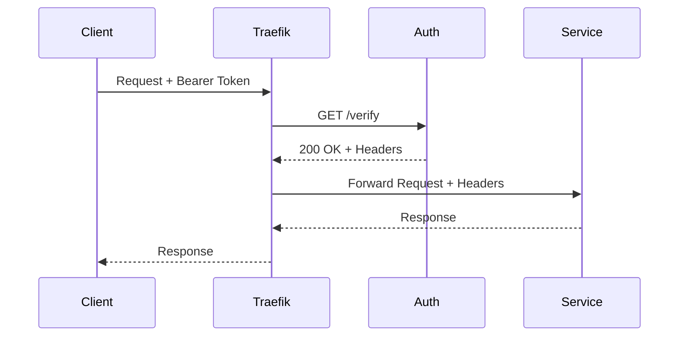

# Traefik Service

The divine reverse proxy that routes all requests, enforces authentication, and provides SSL termination for the gateway.

## Overview

Traefik serves as the gateway's entry point, implementing:

- Reverse proxy for all services
- Automatic SSL/TLS via Let's Encrypt
- ForwardAuth middleware for authentication
- Priority-based routing rules
- Load balancing

## Architecture

```
┌─────────────────────────────────────────┐
│           Traefik v3.0                   │
├─────────────────────────────────────────┤
│  Entrypoints  │  Routers  │ Middlewares │
│  :80 (web)    │  Priority │ ForwardAuth │
│  :443 (websec)│  Rules    │ Headers     │
├─────────────────────────────────────────┤
│         Service Discovery                │
│  Docker Labels → Dynamic Configuration  │
└─────────────────────────────────────────┘
```

## Configuration

### Docker Compose

```yaml
services:
  traefik:
    image: traefik:v3.0
    restart: unless-stopped
    command:
      # API and Dashboard
      - "--api.dashboard=true"
      - "--api.debug=false"

      # Providers
      - "--providers.docker=true"
      - "--providers.docker.exposedbydefault=false"
      - "--providers.docker.network=public"
      - "--providers.file.directory=/middlewares"
      - "--providers.file.watch=true"

      # Entrypoints
      - "--entrypoints.web.address=:80"
      - "--entrypoints.websecure.address=:443"
      - "--entrypoints.web.http.redirections.entrypoint.to=websecure"
      - "--entrypoints.web.http.redirections.entrypoint.scheme=https"

      # Let's Encrypt
      - "--certificatesresolvers.letsencrypt.acme.email=${ACME_EMAIL}"
      - "--certificatesresolvers.letsencrypt.acme.storage=/certificates/acme.json"
      - "--certificatesresolvers.letsencrypt.acme.httpchallenge.entrypoint=web"

      # Logging
      - "--log.level=${TRAEFIK_LOG_LEVEL:-INFO}"
      - "--accesslog=true"
      - "--accesslog.filepath=/logs/access.log"
    ports:
      - "80:80"
      - "443:443"
    volumes:
      - /var/run/docker.sock:/var/run/docker.sock:ro
      - traefik-certificates:/certificates
      - ./traefik/middlewares:/middlewares:ro
      - ./logs/traefik:/logs
    networks:
      - public
    environment:
      - BASE_DOMAIN=${BASE_DOMAIN}
      - ACME_EMAIL=${ACME_EMAIL}
    healthcheck:
      test: ["CMD", "traefik", "healthcheck"]
      interval: 30s
      timeout: 5s
      retries: 3
    labels:
      - "traefik.enable=true"
      # Dashboard (optional)
      - "traefik.http.routers.traefik.rule=Host(`traefik.${BASE_DOMAIN}`)"
      - "traefik.http.routers.traefik.service=api@internal"
      - "traefik.http.routers.traefik.tls=true"
      - "traefik.http.routers.traefik.tls.certresolver=letsencrypt"
```

### Middleware Configuration

The ForwardAuth middleware is generated from template:

```yaml
# middlewares/mcp-auth.yml
http:
  middlewares:
    mcp-auth:
      forwardAuth:
        address: "http://auth:8000/verify"
        authResponseHeaders:
          - "X-User-Id"
          - "X-User-Name"
          - "X-Auth-Token"
        trustForwardHeader: true
```

## Routing Architecture

### Priority System

Traefik uses priority-based routing to ensure correct request handling:

```
Priority 4 (Highest): OAuth endpoints
         ↓
Priority 3: Auth support endpoints
         ↓
Priority 2: MCP service routes
         ↓
Priority 1: Catch-all routes
```

### Routing Rules

#### OAuth Routes (Priority 4)
```yaml
- "traefik.http.routers.auth-oauth.rule=
    PathPrefix(`/register`) ||
    PathPrefix(`/authorize`) ||
    PathPrefix(`/token`) ||
    PathPrefix(`/callback`) ||
    PathPrefix(`/.well-known`)"
- "traefik.http.routers.auth-oauth.priority=4"
```

#### MCP Service Routes (Priority 2)
```yaml
- "traefik.http.routers.mcp-fetch.rule=
    Host(`mcp-fetch.${BASE_DOMAIN}`) ||
    Host(`fetch.${BASE_DOMAIN}`)"
- "traefik.http.routers.mcp-fetch.priority=2"
- "traefik.http.routers.mcp-fetch.middlewares=mcp-auth@file"
```

## SSL/TLS Configuration

### Let's Encrypt Integration

Traefik automatically obtains and renews certificates:

```yaml
certificatesresolvers:
  letsencrypt:
    acme:
      email: ${ACME_EMAIL}
      storage: /certificates/acme.json
      httpChallenge:
        entryPoint: web
```

### Certificate Storage

Certificates stored in persistent volume:
```
traefik-certificates/
└── acme.json  # Let's Encrypt certificates and keys
```

### HTTPS Redirect

All HTTP traffic redirected to HTTPS:
```yaml
entrypoints:
  web:
    address: ":80"
    http:
      redirections:
        entrypoint:
          to: websecure
          scheme: https
```

## Service Discovery

### Docker Labels

Services register with Traefik via labels:

```yaml
labels:
  # Enable Traefik
  - "traefik.enable=true"

  # Routing rule
  - "traefik.http.routers.service.rule=Host(`service.${BASE_DOMAIN}`)"

  # TLS configuration
  - "traefik.http.routers.service.tls=true"
  - "traefik.http.routers.service.tls.certresolver=letsencrypt"

  # Middleware
  - "traefik.http.routers.service.middlewares=mcp-auth@file"

  # Priority
  - "traefik.http.routers.service.priority=2"

  # Service port
  - "traefik.http.services.service.loadbalancer.server.port=3000"
```

### Network Configuration

All services must be on the `public` network:
```yaml
networks:
  public:
    external: true
```

## ForwardAuth Flow



## Load Balancing

### Round Robin (Default)

```yaml
services:
  service:
    loadBalancer:
      servers:
        - url: "http://service1:3000"
        - url: "http://service2:3000"
```

### Sticky Sessions

```yaml
services:
  service:
    loadBalancer:
      sticky:
        cookie:
          name: mcp_session
```

## Health Checks

### Traefik Health

```bash
# Internal health check
docker exec traefik traefik healthcheck

# API endpoint
curl https://traefik.${BASE_DOMAIN}/api/http/routers
```

### Service Health

Traefik checks backend health:
```yaml
services:
  service:
    loadBalancer:
      healthCheck:
        path: /health
        interval: 30s
        timeout: 5s
```

## Logging

### Access Logs

```
# logs/traefik/access.log
{"time":"2024-01-01T12:00:00Z","status":200,"method":"POST","path":"/mcp","duration":"5ms"}
```

### Application Logs

```
# logs/traefik/traefik.log
time="2024-01-01T12:00:00Z" level=info msg="Configuration loaded"
```

### Log Levels

Set via `TRAEFIK_LOG_LEVEL`:
- ERROR
- WARN
- INFO
- DEBUG

## Security Features

### Headers Middleware

```yaml
http:
  middlewares:
    secure-headers:
      headers:
        stsSeconds: 31536000
        stsIncludeSubdomains: true
        stsPreload: true
        contentTypeNosniff: true
        browserXssFilter: true
```


### IP Whitelisting

```yaml
http:
  middlewares:
    ip-whitelist:
      ipWhiteList:
        sourceRange:
          - "10.0.0.0/8"
          - "192.168.0.0/16"
```

## Troubleshooting

### Certificate Issues

```bash
# Check certificate status
docker exec traefik cat /certificates/acme.json | jq '.letsencrypt.Certificates'

# Force renewal
docker exec traefik rm /certificates/acme.json
docker restart traefik
```

### Routing Issues

```bash
# Check active routers
curl https://traefik.${BASE_DOMAIN}/api/http/routers | jq

# Verify service discovery
docker exec traefik traefik show-routing
```

### ForwardAuth Failures

```bash
# Test auth endpoint directly
curl http://auth:8000/verify -H "Authorization: Bearer $TOKEN"

# Check middleware configuration
cat traefik/middlewares/mcp-auth.yml
```

## Performance Tuning

### Connection Limits

```yaml
transport:
  respondingTimeouts:
    readTimeout: 30s
    writeTimeout: 30s
    idleTimeout: 180s
```

### Buffer Sizes

```yaml
transport:
  maxIdleConnsPerHost: 200
  maxResponseHeaderBytes: 1048576
```

## Access Log Analysis

```bash
# Top requested paths
cat logs/traefik/access.log | jq -r '.path' | sort | uniq -c | sort -nr

# Response time analysis
cat logs/traefik/access.log | jq -r '.duration' | sort -n
```

## Best Practices

1. **Use Priority Rules**: Prevent routing conflicts
2. **Enable Access Logs**: For debugging and analytics
3. **Check Certificates**: Verify renewal status
4. **Health Checks**: Configure for all backends
5. **Secure Headers**: Apply security middleware
